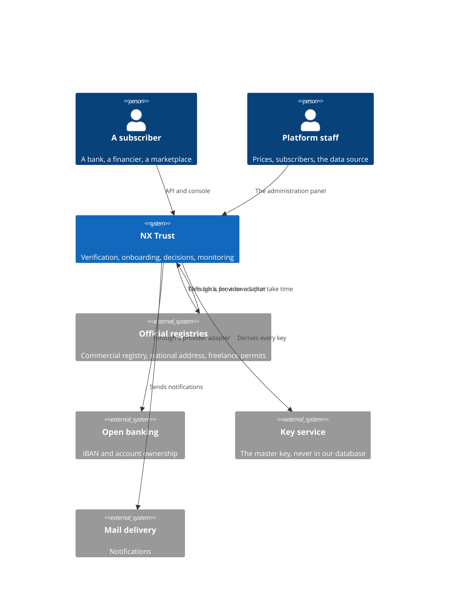
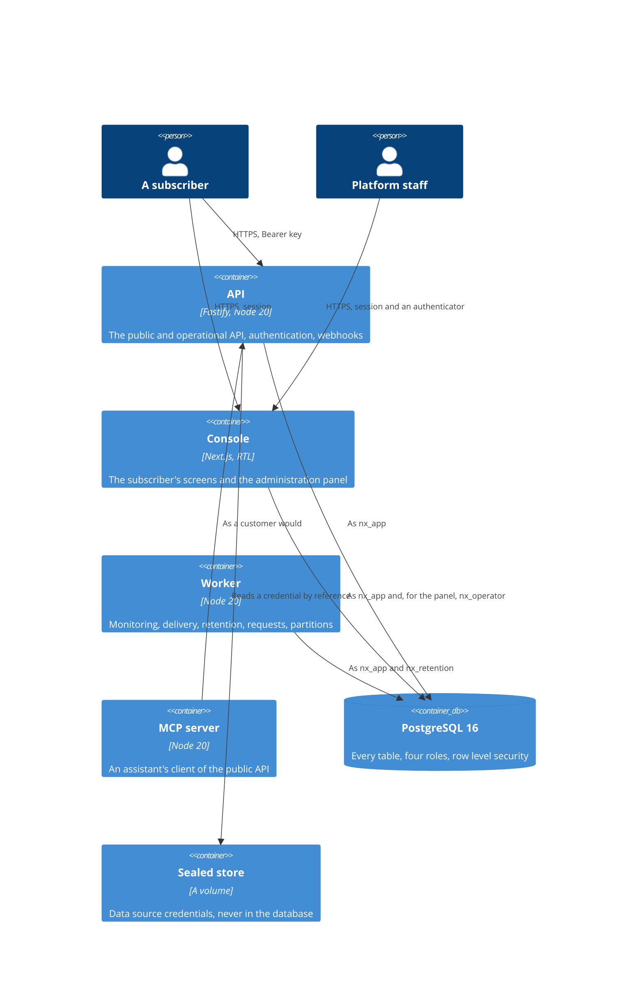
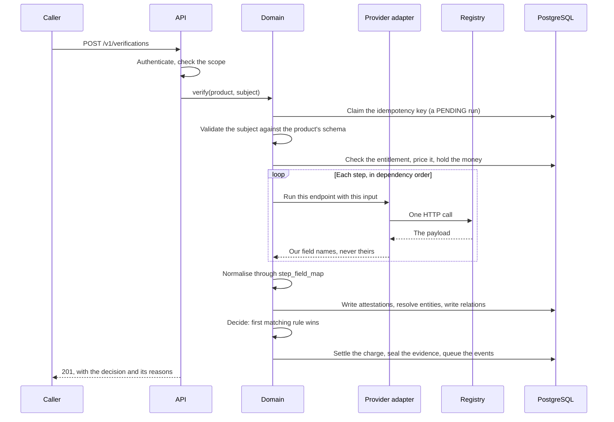

# Architecture

What the system is made of, how a verification travels through it, and why it is shaped this
way. This explains; the facts are in the [reference](../reference/database.md).

---

## The idea underneath

Most verification products are a proxy: you ask them something, they ask a registry, they hand
you the answer. The answer is a moment, and a moment is worthless six months later when somebody
asks what you knew and when.

NX Trust keeps **attestations** instead. One fact about one entity, with the authority that said
it and the moment it was observed, written once and never edited. A customer file is not a record
somebody maintains: it is a projection over those attestations, computed when you look at it.

Everything else follows from that. Knowledge is never lost, so a change is detectable rather than
merely overwritten. Ageing is arithmetic rather than a job. And an auditor asking what you knew
in March gets an answer, because March is still there.

---

## Context



The registries are reached **through a provider**, and the provider is an implementation detail:
its name is in no response a subscriber can see (rule 5), and changing it is a row in
`provider_connections`, not a release.

---

## Containers



**One image, three processes.** The API, the console and the worker share a workspace, a lockfile
and most of their dependencies; the difference between them is one command, chosen at run time.
Building three images would triple the build to save nothing, and would mean what runs in
production is not byte for byte what was tested.

**The MCP server is a client of the API, never of the database.** One process serves one
subscriber, because the key fixes the tenant and no tool takes a tenant argument.

---

## The packages

```
packages/core       the domain. It knows nothing about HTTP or about any provider
packages/db         the schema, the migrations, the roles, the connection helpers
packages/providers  the VerificationProvider interface and its implementations
```

The dependency arrow points one way: `core` depends on `db`, `providers` depends on `core`'s
types, and nothing in `core` imports a provider. A domain that knows which registry it is talking
to is a domain that has to change when the registry does.

---

## What happens during a verification



Every one of those stages is a seam, and each exists because of a way it goes wrong without it.

**The idempotency key is claimed first**, before a provider is called. Checking first and
inserting later lets two concurrent requests both see nothing and both charge.

**The subject is validated against a schema stored in the database.** The product owns its own
input, so adding a product adds no validation code.

**The money is held, not taken.** A run that fails halfway releases the hold; a run that skips a
step is not billed for it, and the database refuses a billed amount on a skipped step.

**Normalisation is rows.** `step_field_map` says which path in the payload becomes which field of
ours, which entity it belongs to and what relation it creates. A new product is rows in three
tables (rule 8); the deployment does not change.

**The decision is ours.** The first matching rule in the workspace's ruleset decides, and the
reasons travel with it. A response that says `FAIL` without saying why is a response somebody has
to phone about.

---

## When the answer takes time

Some sources do not answer the call. The run's step reports `AWAITING`, the API answers **202**,
and a `run_waits` row records what is expected, keyed by a correlation digest.

The source later calls `POST /v1/callbacks/{slug}`. That request is authenticated by its signature
over the raw bytes, deduplicated, and stored as a digest rather than a body. The worker, inside
each tenant's own scope, matches the delivery to the wait and resumes the run.

The resumed run goes through exactly the same code that concludes a direct one, so it bills,
decides and announces once. A run whose source never answers is abandoned after 24 hours, and is
never billed.

---

## Freshness is arithmetic

Nothing ages a field. The `entity_profile` view computes `effective_until` from the time to live
in force now and derives a state: `fresh`, `expiring`, `expired`, or `permanent` for a fact that
does not age.

The time to live comes from three levels, most specific first: a portfolio, then the workspace,
then the system default. Changing one touches no attestation, which is guard 07, and is why a
subscriber can tighten their own policy without rewriting history.

This is also why a **changed** field and an **expired** field are shown differently and never
mixed. Expired means we should look again. Changed means something happened.

---

## Where the money is

- `cost_book`: what a source charges **us** per endpoint. No subscriber can read it.
- `price_book`: versioned prices. A row is closed, never edited, so an invoice from March can be
  recomputed in September.
- `wallets` and `wallet_ledger`: a prepaid balance and an append-only list of movements.
- `packages`, `bundle_grants`: a term commitment drawn down by usage, and prepaid operations.

Spending order is package, then bundle, then wallet. Guard 10 refuses a price below the cost of
the call it makes, which is why the cost is data and not a spreadsheet.

---

## The two surfaces, and why they are separate

The subscriber's console and the administration panel are in one Next.js application but share
nothing else: a different database role, a different connection, a different sign in, and a
different cookie scoped to a different path.

That is not tidiness. Rule 5 says a subscriber must never learn which provider serves them, and
the only way to be certain is that the screens which name providers cannot run without a member
of staff signed in and an operator connection. A bug in a subscriber screen cannot reach a
provider name, because the code that reads one cannot execute.

---

## What is deliberately absent

- **No per-customer code branch.** One product, many subscribers. A deployment difference is an
  environment variable, never a second codebase.
- **No free text.** Every field carries an authority and an observation time (rule 6). There are
  no notes, no tasks and no contacts, because a platform that lets you type a fact is a platform
  where a fact can be wrong and nobody knows when it became so. The single exception is a review
  case's written reason, which is a human's decision and is labelled as one.
- **No cache, no projection table, no partitioning** beyond the audit log, until a measurement
  demands it (rule 9).
